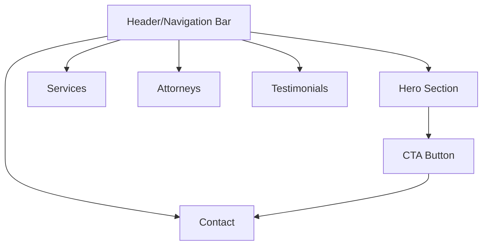
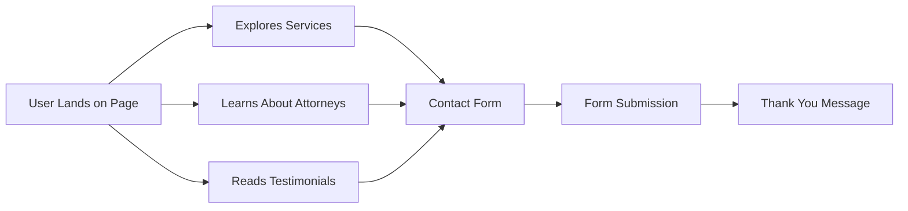

# Law Firm Landing Page

A professional single-page landing page designed for a law firm to showcase services, team members, and contact information.

## Table of Contents
- [Overview](#overview)
- [Features](#features)
- [Navigation](#navigation)
- [Technical Stack](#technical-stack)
- [Setup and Installation](#setup-and-installation)
- [Development Guidelines](#development-guidelines)
- [Deployment](#deployment)
- [Maintenance](#maintenance)
- [Contact](#contact)

## Overview
This project is a responsive single-page landing website for a law firm, designed to provide potential clients with essential information and a means to contact the firm.

## Features
- **Hero Section** - Prominent introduction with call-to-action
- **Services** - Overview of legal services offered
- **Attorney Profiles** - Team member introductions and expertise
- **Testimonials** - Client reviews and success stories
- **Contact Form** - Easy way for potential clients to reach out
- **Responsive Design** - Optimized for all devices
- **SEO Optimized** - Structured for search engine visibility

## Navigation

### Site Navigation Flowchart


### User Journey Flowchart


## Technical Stack
- HTML5
- CSS3/SASS
- JavaScript
- Bootstrap or Tailwind CSS (for responsive design)
- Font Awesome (for icons)
- Google Analytics (for tracking)
- PHP/AJAX (for contact form processing)

## Setup and Installation
1. Clone the repository:
   ```
   git clone https://github.com/username/law-firm.git
   ```
2. Navigate to the project directory:
   ```
   cd law-firm
   ```
3. Open index.html in your browser or set up a local server.

## Development Guidelines
- Follow BEM methodology for CSS naming conventions
- Ensure all images have appropriate alt text for accessibility
- Maintain semantic HTML structure
- Optimize images before committing
- Test across multiple browsers and devices

## Deployment
1. Ensure all files are minified for production
2. Upload to web hosting via FTP or deploy through a CI/CD pipeline
3. Set up SSL certificate for HTTPS
4. Configure proper redirects and 404 pages

## Maintenance
- Regular content updates for services and attorney profiles
- Monthly review of contact form functionality
- Quarterly SEO review and optimization
- Regular backups of the website
